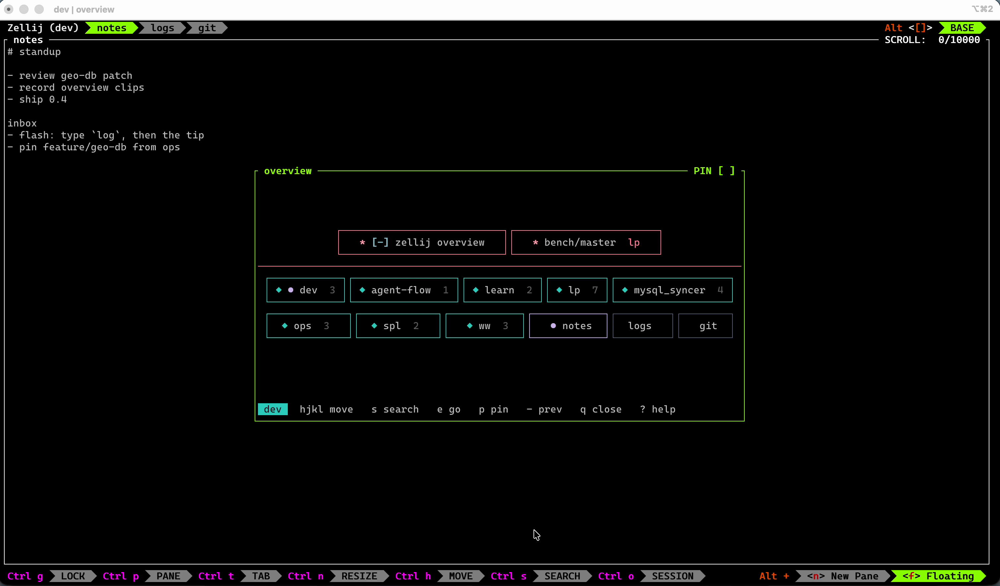
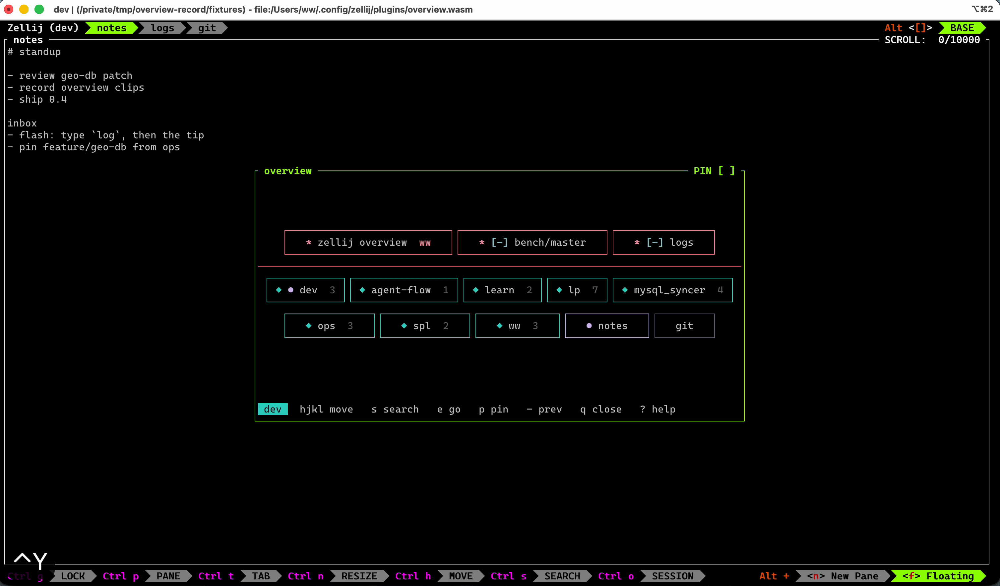
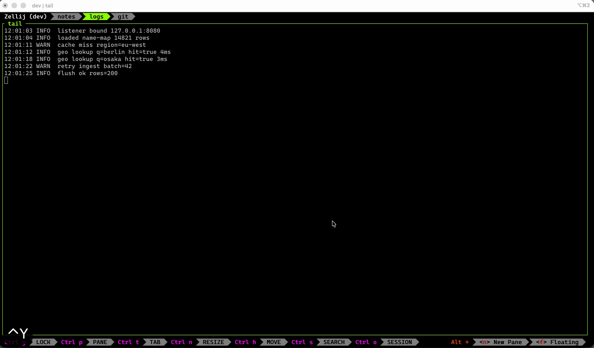
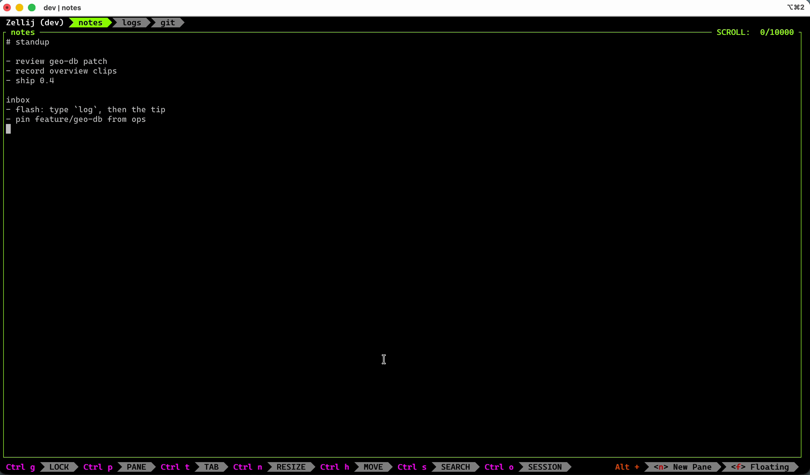

# zellij-overview

English · [中文](docs/zh/README.md)

Browse and switch Zellij sessions and tabs from a floating window.

Press `Ctrl+y` to open. Pinned tabs sit on their own band, then session cards, then the current session's unpinned tabs. `e` or a Flash tip on a session opens that session's tab board; press again on a tab to jump. Tabs in the current session can be jumped from the home board. Press `s` to search the titles on the current board.


## Install

Zellij 0.44 or newer is required.

### From a Release

Download the WASM from
[Releases](https://github.com/www159-used/zellij-overview/releases),
rename it, and put it in the plugin directory:

```bash
mkdir -p ~/.config/zellij/plugins
mv zellij-overview-v*.wasm ~/.config/zellij/plugins/zellij-overview.wasm
```

### From source

`rust-toolchain.toml` pins Rust `1.95.0` and the `wasm32-wasip1` target:

```bash
git clone https://github.com/www159-used/zellij-overview.git
cd zellij-overview
./scripts/install.sh
```

This builds the WASM and copies it to `~/.config/zellij/plugins/zellij-overview.wasm`. Override the destination with `OVERVIEW_PLUGIN_PATH`.

## Keybinding

Add this to `keybinds` in `~/.config/zellij/config.kdl`.
Use a `file:` URL, not a plugin alias, so instance identity stays consistent.

```kdl
shared {
    bind "Ctrl y" {
        LaunchPlugin "file:~/.config/zellij/plugins/zellij-overview.wasm" {
            floating true
            skip_plugin_cache true
        }
    }
}
```

On first launch Zellij asks for permission to read and change session state. Allow it. Press `Ctrl+y` again to close overview.

## Usage

The footer shows the common keys. Press `?` inside overview for the full help.

### Flash search



Press `s`, type part of a title, then press the tip (such as `a`) to jump. Example: `log` then the tip lands on `logs`. `Esc` leaves search. A tip on a session card opens that session's tab board.

### Another session's tabs



`e` or a Flash tip on a session card opens that session's tabs without leaving overview. `e` on a tab jumps. `Esc` / `q` first returns home.

### Pin a tab



`p` pins the selected tab to the front of the board. A pin from another session shows that session's name, so the home board can jump there in one step.

### Previous



A card marked `[-]` is where `-` returns. Same session: the previous tab. After a session jump: `-` first opens that session's tab board, then `-` again jumps to its last tab. If that tab is already pinned, `-` jumps in one step.

## Known limits

Zellij shows or hides the floating layer as a whole. Opening overview also reveals other floating panes that were hidden; closing it restores that layer to the state from before overview opened.

## Develop

```bash
cargo fmt --check
cargo lint
# Host-side core tests; do not use the WASM target
cargo test --lib
cargo wasm
zellij -l zellij.kdl
```

The development layout loads `target/wasm32-wasip1/release/zellij-overview.wasm`. Colors live in `src/theme.css`. Defaults are compiled in. To change colors without rebuilding, copy that file to the plugin `/cache/theme.css` and reopen overview. Closing overview appends one local line to `/cache/usage.jsonl`. Summarize with `./scripts/usage-summary.sh`.

## License

This project is licensed under the [GNU Affero General Public License v3.0 only](LICENSE).
